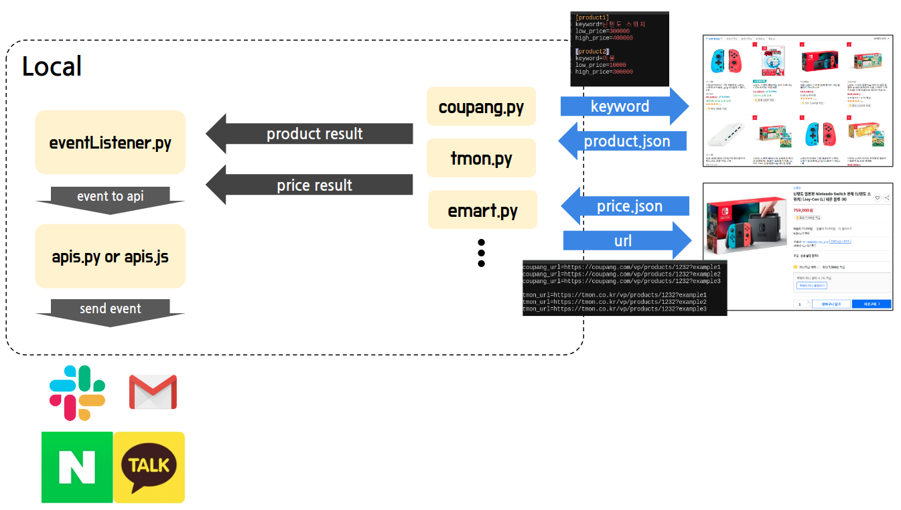

# Observer_KR

닌텐도 스위치를 사기 위해 시작했던 프로젝트이지만 당근마켓에서 이미 구했으므로 기존 구현에서 더욱 확장해서 사고싶은 물건을 원하는 가격대에 구매할 수 있게 감시해주는 

## Idea

- 키워드와 금액대로 내가 원하는 물건을 어느 정도 특정지을 수 있지 않을까
  - ex ) 닌텐도 스위치, 340,000 ~ 380,000 원
  - 원하는 물건이 선택이 안 될 수도 있음.
- 사용자가 직접 입력한 URL을 감시하면서 사용자에게 금액 변화를 KakaoTalk, SMS, Email 을 통해 전송
  - 원하는 물건은 선택 되나 금액 변화( 할인 )가 없을 수도 있음.

## Architecture

언제든지 수정 될 수 있습니다.  ( 2020.06.14 )

